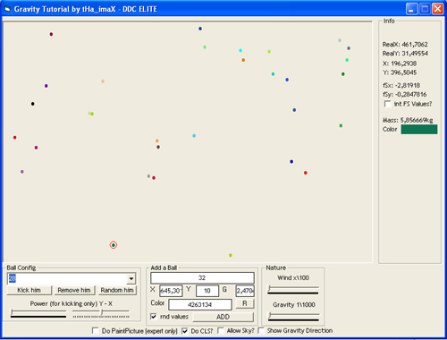



## vB\_Gravity VOTE\!\!\!

### Description

The Source Simulates Gravity. Its the Second attemp to post it. the last time it was deleted.
 
### More Info
 
No Params

Just Run

No Returns

It can lag if you put a lot of balls into the collection.

             |
---                |---
**Submitted On**   |2004-09-27 14:19:04
**By**             |[tHa\_imaX](https://github.com/Planet-Source-Code/PSCIndex/blob/master/ByAuthor/tha-imax.md)
**Level**          |Advanced
**User Rating**    |4.7 (14 globes from 3 users)
**Compatibility**  |VB 5\.0, VB 6\.0
**Category**       |[Math/ Dates](https://github.com/Planet-Source-Code/PSCIndex/blob/master/ByCategory/math-dates__1-37.md)
**World**          |[Visual Basic](https://github.com/Planet-Source-Code/PSCIndex/blob/master/ByWorld/visual-basic.md)
**Archive File**   |[vB\_Gravity1798399282004\.zip](https://github.com/Planet-Source-Code/tha-imax-vb-gravity-vote__1-56400/archive/master.zip)

